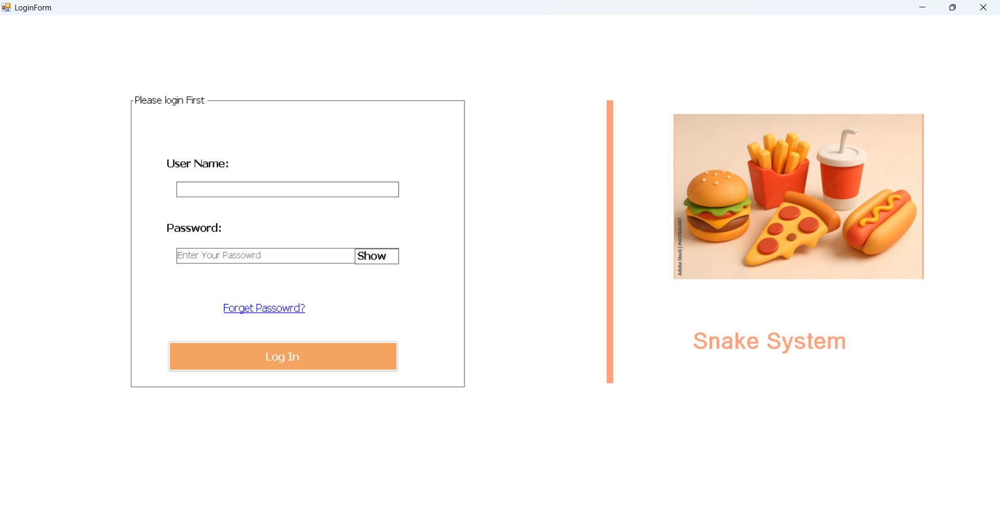
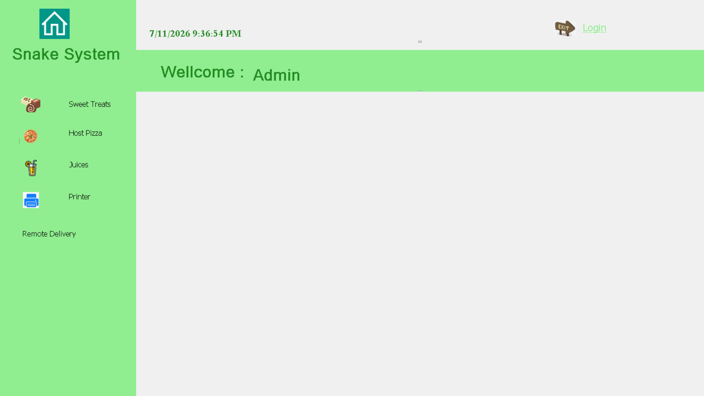
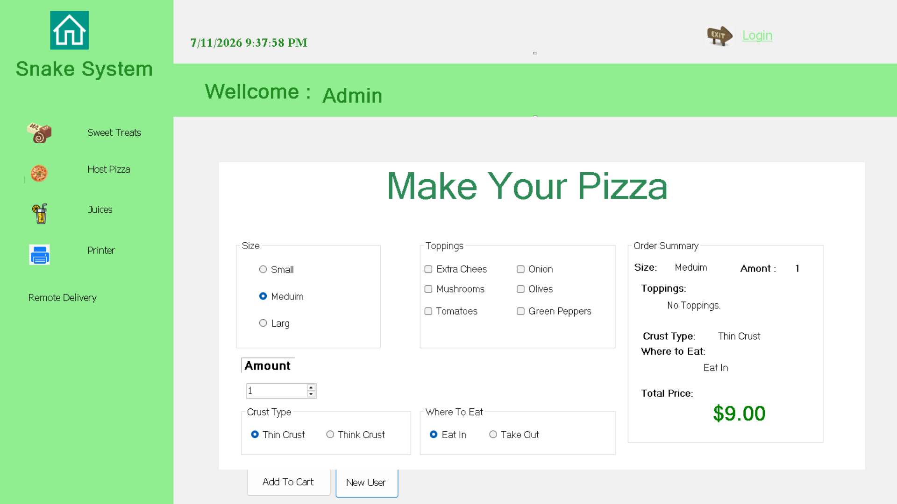
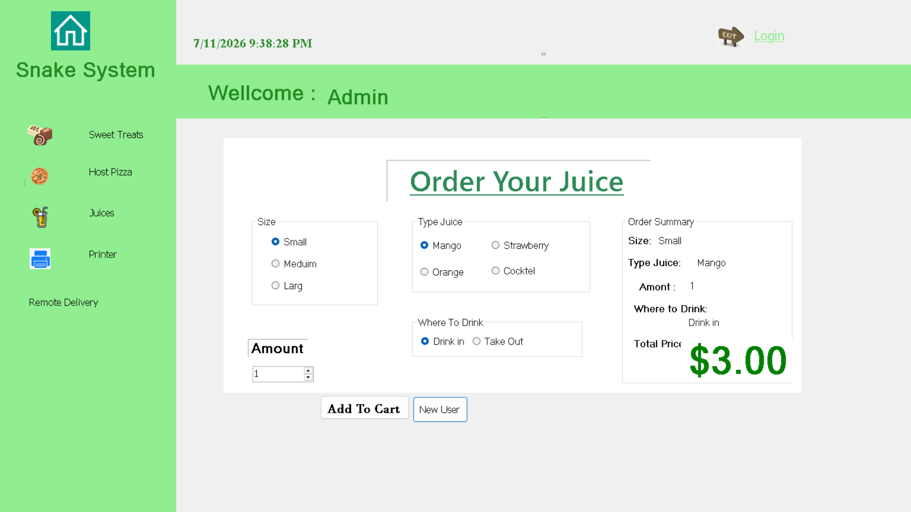
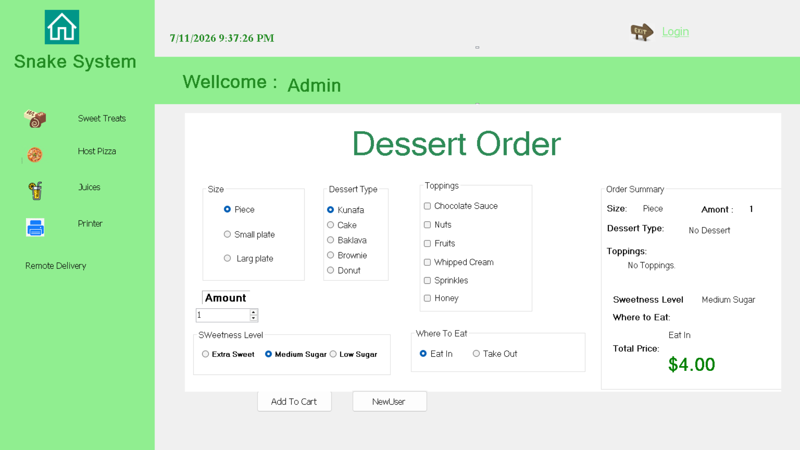
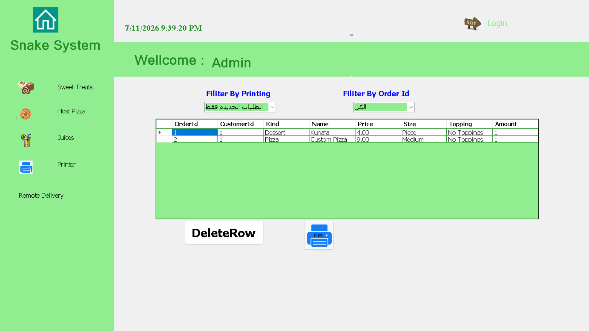
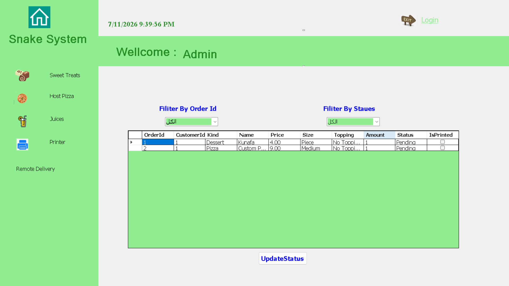

# 🍕 Pizza Ordering Management System


A desktop food ordering application built using **C# WinForms**, **.NET Framework 4.8**, and **JSON-based local storage**.

The application allows users to create and manage pizza, juice, and dessert orders, print customer bills, and track delivery status through a simple desktop interface.

---

# 📸 Application Preview

## 🔐 Login

<p align="center">

</p>

---

## 🏠 Main Menu

<p align="center">

</p>

---

## 🍕 Pizza Order

<p align="center">

</p>

---

## 🧃 Juice Order

<p align="center">

</p>

---

## 🍰 Dessert Order

<p align="center">

</p>

---

## 🖨 Print Bills

<p align="center">

</p>

---

## 🚚 Remote Delivery

<p align="center">

</p>

---

# 📑 Table of Contents

- Features
- Screenshots
- Technology Stack
- Architecture
- Database
- Installation
- Project Structure
- Notes
- Future Improvements
- Author

---

# 🚀 Features

## 🔐 Authentication

The application includes a simple login system.

Features

- User login
- Access control
- Main menu navigation

> The current implementation uses predefined user accounts.

---

## 🍕 Pizza Ordering

Create customized pizza orders.

Features

- Select pizza size
- Choose crust type
- Select toppings
- Specify quantity
- Automatic price calculation

---

## 🧃 Juice Ordering

Create juice orders.

Features

- Select juice type
- Select size
- Specify quantity
- Automatic price calculation

---

## 🍰 Dessert Ordering

Create dessert orders.

Features

- Select dessert type
- Select size
- Choose toppings
- Specify quantity
- Automatic price calculation

---

## 🛒 Order Management

Manage customer orders.

Features

- Group orders by customer
- View all orders
- Delete orders
- Mark printed orders
- Filter printed and unprinted orders

---

## 🖨 Printing

Generate printable customer bills.

Features

- Print Preview
- Print customer orders
- Calculate order totals
- Separate printed orders

---

## 🚚 Delivery Management

Track customer deliveries.

Features

- View delivery orders
- Update delivery status
- Track order progress

Delivery Workflow

```text
Pending
      │
      ▼
Delivering
      │
      ▼
Delivered
```

---

## 💾 Local Storage

Orders are stored locally.

Features

- JSON persistence
- Automatic loading
- Automatic saving
- No external database required

---

# 🛠 Technology Stack

| Category | Technology |
|----------|------------|
| Language | C# |
| Framework | .NET Framework 4.8 |
| UI | Windows Forms |
| Storage | JSON |
| Serialization | Newtonsoft.Json |
| Architecture | Layered Architecture |
| Printing | PrintDocument |
| IDE | Visual Studio |
| Version Control | Git & GitHub |

---

# 🏛 Architecture

The project follows a simple layered architecture.

```text
                 +----------------------+
                 |  Presentation Layer  |
                 |      WinForms UI     |
                 +----------+-----------+
                            |
                            ▼
                 +----------------------+
                 |   Service Layer      |
                 | ShoppingCartService  |
                 +----------+-----------+
                            |
                            ▼
                 +----------------------+
                 | Persistence Layer    |
                 |    JsonDatabase      |
                 +----------+-----------+
                            |
                            ▼
                 +----------------------+
                 |     orders.json      |
                 +----------------------+
```

---

## 🖥 Presentation Layer

Responsibilities

- User interaction
- Navigation
- Order forms
- Printing
- Delivery management

Main Forms

```text
LoginForm
MainMenu
OrderPizzaForm
OrderJuiceForm
OrderDessertForm
OrdersForm
RemoteForm
```

---

## ⚙ Service Layer

Main Class

```text
ShoppingCartService
```

Responsibilities

- Manage orders
- Calculate prices
- Group customer orders
- Save changes
- Load existing orders

---

## 💾 Persistence Layer

Main Class

```text
JsonDatabase
```

Responsibilities

- Read orders.json
- Save orders.json
- JSON serialization
- JSON deserialization

---

# 🗄 Database

Instead of using SQL Server, this application stores data locally.

Storage

```text
orders.json
```

Stored Information

```text
OrderId
CustomerId
Kind
Name
Price
Size
Topping
Amount
Status
IsPrinted
```
---

# ⚙ Installation

## Requirements

Before running the application, make sure you have:

- Windows
- Visual Studio 2022 (or newer)
- .NET Framework 4.8 Developer Pack

---

## Setup

### 1. Clone the repository

```bash
git clone https://github.com/Albarafahed/Pizza-Windows-Forms.git
```

> Replace the repository URL with the correct GitHub repository if necessary.

---

### 2. Open the project

Open

```text
Pizza.csproj
```

or the solution file if available.

---

### 3. Restore NuGet packages

The project uses

```text
Newtonsoft.Json
```

Visual Studio will restore the package automatically when opening the project.

---

### 4. Build and Run

Build the project and press **F5**.

The application automatically creates

```text
orders.json
```

if it does not already exist.

---

# ▶ Running the Project

Application startup flow

```text
Program.cs
      │
      ▼
LoginForm
      │
      ▼
MainMenu
```

From the main menu you can open

- Pizza Ordering
- Juice Ordering
- Dessert Ordering
- Orders
- Remote Delivery

---

# 📂 Project Structure

```text
Pizza
│
├── Pizza.csproj
├── Program.cs
├── App.config
│
├── Product.cs
├── ShoppingCartService.cs
├── JsonDatabase.cs
│
├── LoginForm
├── MainMenu
├── OrderPizzaForm
├── OrderJuiceForm
├── OrderDessertForm
├── OrdersForm
└── RemoteForm
│
├── Images
│   ├── frmLogin.png
│   ├── frmMain.png
│   ├── frmPizzaOrder.png
│   ├── frmJuicesOrder.png
│   ├── frmDesertOrder.png
│   ├── frmPrintBills.png
│   └── frmRemoteDelivery.png
│
├── packages
│   └── Newtonsoft.Json
│
└── README.md
```

---

# 📝 Notes

- Desktop Windows Forms application.
- Uses local JSON storage.
- No external database required.
- Orders are automatically saved after changes.
- Supports Print Preview.
- Uses Newtonsoft.Json for serialization.
- Customer orders are grouped by Customer ID.

---

# 🔒 Security Notes

Current implementation

- Orders are stored as plain JSON files.
- Login credentials are predefined in the application.
- No password hashing is implemented.

Possible improvements

- Encrypt stored data.
- Replace hard-coded users with database authentication.
- Add role-based authorization.

---

# ⚠ Known Limitations

Current limitations include

- No automated tests.
- No logging framework.
- Single-user desktop application.
- No database support.
- Hard-coded login credentials.
- Business logic is tightly coupled with the UI.
- No configuration file for the JSON storage location.

---

# 🚀 Future Improvements

### Features

- Search customer orders.
- Order history.
- Receipt export to PDF.
- Sales dashboard.
- Customer management.
- Inventory management.

---

### Architecture

- Repository Pattern.
- Dependency Injection.
- Better separation of business logic.
- Improved exception handling.

---

### Storage

- Replace JSON with SQLite.
- Support SQL Server.
- Configurable storage location.
- Automatic backups.

---

### Development

- Unit Testing.
- Integration Testing.
- Logging using Serilog.
- Configuration through App.config.

---

# 📷 Images

Application screenshots are stored in

```text
Images
│
├── frmLogin.png
├── frmMain.png
├── frmPizzaOrder.png
├── frmJuicesOrder.png
├── frmDesertOrder.png
├── frmPrintBills.png
└── frmRemoteDelivery.png
```

---

# 📚 Learning Objectives

This project demonstrates practical experience with:

- C#
- Windows Forms
- Object-Oriented Programming (OOP)
- JSON Serialization
- Newtonsoft.Json
- Desktop Application Development
- PrintDocument
- Event-Driven Programming

---

# 👤 Author

**Albara Fahed Alharissy**

.NET Developer

- GitHub: https://github.com/Albarafahed
- LinkedIn: https://www.linkedin.com/in/albara-csharp-developer/

---

# ⭐ Support

If you found this project useful, consider giving it a **⭐ Star** on GitHub.

---

# 📄 License

This repository does not currently include a LICENSE file.